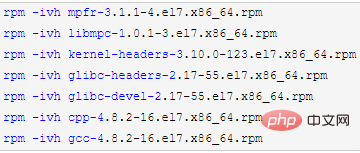

# centos怎么安装gcc

使用yum命令安装还是非常easy的。

命令如下：

```
yum -y install gcc gcc-c++ kernel-devel ``//安装gcc、c++编译器以及内核文件
```

推荐教程：[centos使用教程](https://www.php.cn/centos/)

手动安装gcc

1、从CentOS7的系统安装镜像中取出需要的rpm包（也可以通过别的方式获取）：解压镜像文件，进入"Packages"目录，里面很多rpm包，取出如下几个：


2、将这些包上传到待安装的系统中【可安装Xftp进行上传】，按如下顺序执行安装命令：



也可以使用如下命令统一安装：

```
rpm -Uvh *.rpm --nodeps --force
```

相关视频教程推荐：[linux视频教程](https://www.php.cn/course/list/33.html)

以上就是centos怎么安装gcc的详细内容，更多请关注php中文网其它相关文章！

声明：本文内容由网友自发贡献，版权归原作者所有，本站不承担相应法律责任。如您发现有涉嫌抄袭侵权的内容，请联系admin@php.cn核实处理。